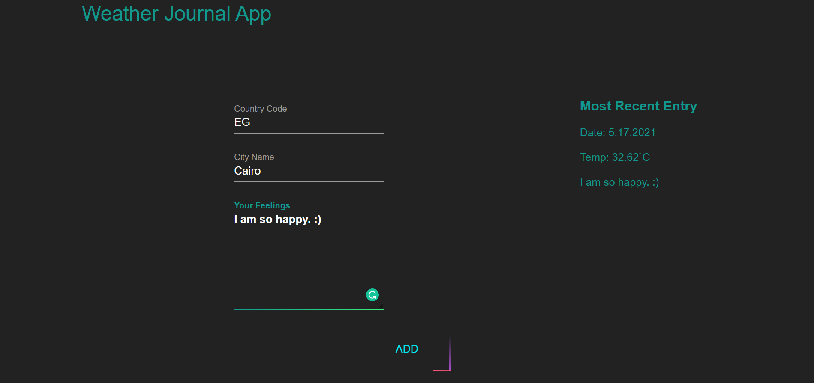

# Weather-Journal App Project


## Table of Contents

 - [Introduction](#introduction)
 - [Project Summary](#project-summary)
 - [Objective](#objective)
 - [Try It](#try-it)


## Introduction
This project requires you to create an asynchronous web app that uses Web API and user data to dynamically update the UI. 


## Project Summary
Starting from setup Node environment, Install the packages Express, Body-Parser, and Cors from the terminal and set up a local server in your machine.   

Next, you will route GET request to retrieve data about specific from OpenWeatherMap API and endPoint data from the local server-side, besides GET request you will also route POST request that adds incoming data to the endPoint object, you will chain all of this together.   

Finally, chain another Promise that updates the UI dynamically by retrieving data from our app, select the necessary elements on the DOM, and then update their necessary values to reflect the dynamic values.


## Objective
combining your skills in HTML, CSS, and JavaScript into a large project. Aside from solidifying your skills with these three technologies, you’ll discover how to set up a local server with Node express, learn how to routes GET and POST requests, chain Promises, and work with web APIs.

## Try It
You can only see the designs on codepen.io from this [link](https://codepen.io/omarelshopky/pen/zYZbONE), Or try all its functionality by:
* Clone the repo from [here](https://github.com/omarelshopky/Weather_Journal_App.git)
  ```bash
  git clone https://github.com/omarhesham2/Front-End_Web_Development_Professional_Nanodegree.git
  ```
* Make sure Node, express, and all dependencies.
  ```bash
  node install express
  node install body-parser
  node install cors
  ```
* Run the server from the terminal.
  ```bash
  node server.js
  ```
* Open [http://localhost:3000/](http://localhost:3000/) in Google Chrome , Firefox or any other browser
* Enjoy :)
